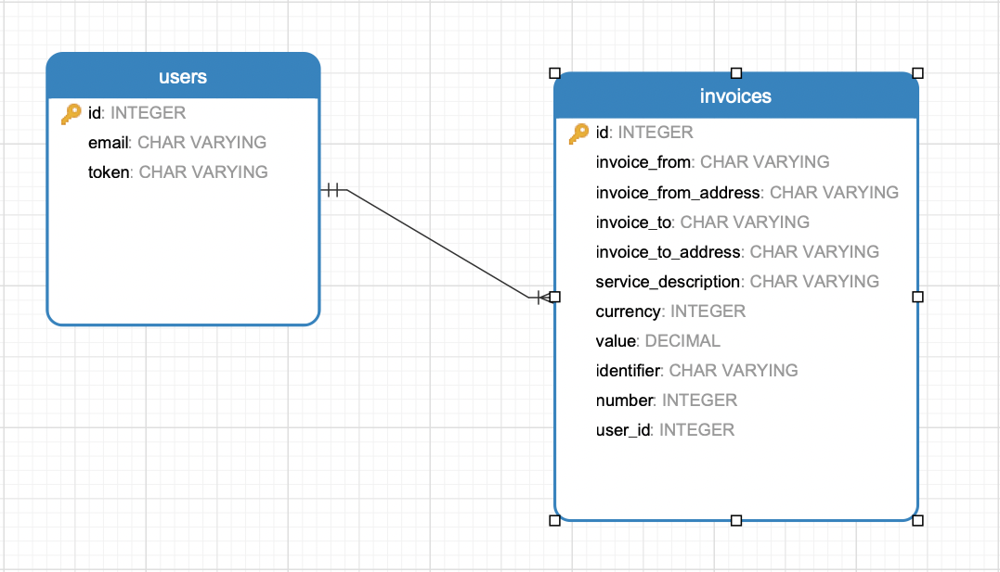
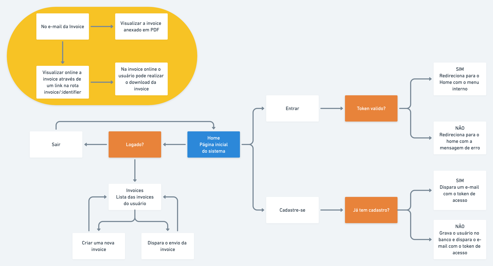

# Challenge Husky

# Executando o projeto
1. Instale o ruby `3.0.2` pelo seu gerenciador de ruby.
2. Execute `gem install bundler` para instalar o bundler.
3. Execute `gem install rails -v=6.1.4` para instalar o rails.
3. Execute `bundle install` para instalar todas as gems.
4. Crie o arquivo `.env.local` na pasta raíz do projeto com o conteúdo: 

```
DATABASE_URL=postgres://postgres:postgres@db:5432/challenge_husky_development
```

5. Crie o arquivo `.env.test` na pasta raíz do projeto com o conteúdo: 
```
DATABASE_URL=postgres://postgres:postgres@db:5432/challenge_husky_test
```

5. Execute `rails db:create` e `rails db:migrate` para criar o banco e dados e as migrações
6. E para finalizar, execute `rails server` para executar o projeto.

# Usa docker?

1. Na pasta raíz tem dois arquivo `Dockerfile` com as informações para gerar a imagem e o `docker-compose.yml` com as definições de orquestrações de todas as imagens necessárias para executar o projeto.
2. Antes de gerar a imagem crie os arquivos `.env.local e .env.test` com a URL do banco de dados mostrando acima.
3. Para gerar a imagem do projeto execute `docker compose build`
4. Execute o comando `docker compose up -d` para iniciar o projeto.
5. Para visualizar o log do rails faço os três passos abaixo:
5.1 Execute o comando: `docker ps` para listar todos os containers criados pelo comando `docker compose up -d`.
5.2 Na listagem a primeira coluna vai aparecer o `id do container`, copie do container que tem o nome de `challenge_husky_web`.
5.3 Execute o comando: `docker attach ID-OF-CONTAINER` para ter o log em live load (tail)
6. Para executar algum comando do rails digite `docker compose run --rm web SEU-COMANDO-RAILS/SEU-COMANDO-BASH`.
6.1 Exemplo: Quero ver as rotas `docker compoase run --rm web rails routes`.

# Dependências do projeto

1. Tenha instalado o `wkhtmltopdf` no seu computador para funcionar a geração/visualização de PDF, se for usar sem o docker adicione a gem `wkhtmltopdf-binary` que ele vai baixar e instalar o binário do `wkhtmltopdf`.
2. Instale a gem `mailcatcher` ou execute `bundle install` para instalar essa gem, ela é necessária para visualiar os e-mails.
3. Instale PostgreSQL pois é ele que foi usado para banco de dados.

# Visualizando e-mail

Para visualizar os e-mails enviados pelo sistema abra o navegador e digite `localhost:1080`, vai aparecer uma interface básica para e-mails.

# MER


O sistema compoem duas entidades: `users` para fazer autenticação e controler das invoices e a entidade `invoice` para gerar as invoices é o objeto desse projeto.

# Fluxos do sistema



Observações do sistema: 
1. O sistema funciona iniciando o usuário realizando um cadastro e ao logar esse usuário pode criar e enviar suas invoices.

2. Todo a interação interna do sistema só é permitido com um usuário logado (session pelo token).

3. Quando o usuário sai do sistema um novo token é gerado e para ter acesso ao token é necessário o usuário preencher o formulário de cadastre-se para receber o token pelo e-mail.

4. Se o usuário tentar cadastrar novamente, ele recebe um e-mail com o seu token atualizado.

5. a visualização da invoice não é necessário está logado, basta ter o link da invoice.

# O que poderia ser melhorado?

1. Atualmente o PDF é gerado e salvo no próprio servidor, o Active Storage e juntamente com o S3 poderia é a melhor forma de gerenciar os arquivos, tirando do disco local esse gerencimento.

2. Para busca foi feito as queries manualmente, eu usuária Ransack, mas pelo tempo fiz sem o Ransack.

3. A versão de API que por conta do tempo eu não fiz.

4. Os envios dos e-mails estão sendo feito sem background job, assim como a geração dos PDFs. Por conta do tempo e para não deixar o projeto com mais configuração para executar, obteu por enviar sincronamente.